<div align="center">

# Antenne

Fleet launches, features, and updates as a news feed

[![Live][badge-site]][url-site]
[![HTML5][badge-html]][url-html]
[![CSS3][badge-css]][url-css]
[![JavaScript][badge-js]][url-js]
[![Claude Code][badge-claude]][url-claude]
[![License][badge-license]](LICENSE)

[badge-site]:    https://img.shields.io/badge/live_site-0063e5?style=for-the-badge&logo=googlechrome&logoColor=white
[badge-html]:    https://img.shields.io/badge/HTML5-E34F26?style=for-the-badge&logo=html5&logoColor=white
[badge-css]:     https://img.shields.io/badge/CSS3-1572B6?style=for-the-badge&logo=css3&logoColor=white
[badge-js]:      https://img.shields.io/badge/JavaScript-F7DF1E?style=for-the-badge&logo=javascript&logoColor=black
[badge-claude]:  https://img.shields.io/badge/Claude_Code-CC785C?style=for-the-badge&logo=anthropic&logoColor=white
[badge-license]: https://img.shields.io/badge/license-MIT-404040?style=for-the-badge

[url-site]:   https://antenne.neorgon.com/
[url-html]:   #
[url-css]:    #
[url-js]:     #
[url-claude]: https://claude.ai/code

</div>

---

## Overview

Antenne reports what shipped across the Neorgon fleet: launches, features, and
fixes as short news stories, drafted from the fleet's own work logs. Every story
passes a human on the desk before it publishes, so the feed carries what someone
decided was worth telling, not a firehose of commits. The same feed powers an
embeddable strip for the hub's corner popup and an RSS feed.

Stories are **submitted** straight to a private queue, **reviewed** on
`desk.html` by people who sign in with a Neorgon account and hold a desk role,
and **published** by a workflow that commits them to `data/posts.json`. Nobody
saves a file or runs git to publish a story.

**Live:** [antenne.neorgon.com](https://antenne.neorgon.com/)

---

## Features

- **News feed**: stories with kind badges (launch, feature, fix, note), a hero
  slot for the latest, filters, and full-text search
- **Embed strip**: `?embed=1&limit=N` renders a compact headline list for
  iframes, with no storage writes and an attribution link back to the full site;
  add `&brand=0` to drop the strip's own masthead when the host chrome already
  names the site (the hub's corner popup does)
- **Chrome toggle**: the header auto-hides while you read, and `h` hides the
  header and footer entirely
- **Deep links**: `#p=<story-id>` opens a story directly; RSS at `feed.xml`
- **NEW markers**: stories newer than your last visit get flagged, remembered
  per browser
- **The desk** (`desk.html`, not indexed): a signed-in review queue, described
  below

The public pages load nothing from Clerk or Convex: `index.html`, the embed
strip and `feed.xml` read only the committed archive.

---

## How a story gets published

```
/newsroom (a laptop)      newsroom workflow        desk.html "New story"
   │ submit-drafts.py      (cloud drafter)            │ drafts:submit
   └─── signed POST /submit ───┘                      │
                 ▼                                    ▼
        Convex: private draft queue (pending) ◀───────┘
                 │  a link check runs on every new story and link change
                 │  a reviewer, an editor or an owner approves on desk.html
                 ▼
        approved: publishes after the delay (5 minutes by default)
                 │  Convex starts .github/workflows/publish.yml
                 ▼
        scripts/publish-approved.py: claim, merge into data/posts.json,
        rebuild feed.xml and index.html, commit as antenne-publisher[bot],
        push main, wait for the GitHub Pages build
                 ▼
        committed (verified at its commit), then live (seen on the site)
```

1. **Submit.** `scripts/submit-drafts.py FILE...` validates every story with the
   same rules `build-feed.py` applies (submit mode: the id starts with its date,
   the date is within 60 days back and 1 day ahead, links are https on
   `neorgon.com` or `github.com/energon-a-secas/`, no em dash, no token-like
   text) and refuses the whole run if one fails. It then signs and sends them,
   at most 12 stories and 64000 bytes per request. `--dry-run` validates, counts
   the requests it would send and sends nothing; `--status` prints the queue by
   id and age and the last publish run. It prints ids, outcomes and counts,
   never story text. From outside this repo (the monorepo's `/newsroom`, its
   cloud drafter and watchdog, the docket and closeout collectors) it runs only
   as the owner reviewed it: see "Reviewed scripts" below. Members can also
   submit from the desk's "New story" form, at most 20 pending stories each.
2. **Review.** On the desk, a story is approved, edited, assigned, taken or
   spiked. Approving records the story's hash: an edit afterwards returns the
   story to pending, and publishing sends back any story whose text no longer
   matches its approval.
3. **Publish.** When the delay is up, Convex dispatches `publish.yml`, which
   commits the due approvals (at most 25 a run) in one commit. A push to `main`
   by anyone but the App also runs it, and publishes whatever is due.
   `publish-approved.py` removes its three credentials from its own environment
   once read, so `git` and `build-feed.py` inherit none, and hands the App's
   push token only to the one `git push`, never in argv. Output and the failure
   issue ("Antenne publish needs attention") carry ids and counts only.
4. **Committed, then live.** Convex reads `data/posts.json` at the pushed commit
   and marks each story committed, then reads the live site every 10 minutes and
   marks it live. Pages caches for 10 minutes, so live can trail by 20.

Before this, drafts lived in a gitignored `data/drafts/` folder on one laptop,
the desk worked only on localhost, and publishing was a save dialog plus a hand
commit. All of that is gone, `make drafts-clean` included. An older clone may
still hold a `data/drafts/` folder: delete it. Nothing writes that path now, and
`.gitignore` still ignores it as a guard, so a stale one is never committed.

### Roles on the desk

Sign-in is the fleet's one Clerk account (the Neorgon Auth Kit), on `desk.html`
only. What an account may do is decided in Convex on every call, never by
anything the browser sends: owners are listed in the deployment's `DESK_OWNERS`
setting, everyone else holds a role an owner granted.

| Role | May |
|---|---|
| Submitter | Submit; edit their own story while it is pending, and spike it while it is pending or approved |
| Reviewer | Submit; take an unassigned story; edit stories they hold; spike or approve stories they hold or nobody holds (approving takes it), but never approve their own story or one with links outside the allowlist; withdraw their own approval |
| Editor | What a reviewer may, on any story, links outside the allowlist included, except approving their own; assign, reopen spiked stories, publish now and retry |
| Owner | Everything, including approving their own story (recorded as a self-approval), overriding a blocking link check, and People and settings |

Each person holds at most 20 pending stories of their own at a time, owners
included; the 21st is refused until one of them is decided. A signed-in account
with no role sees its account id and a "Request access" button; an owner grants
a role in the People panel. `DESK_DENY` removes anyone's
role at once, and `DESK_FROZEN=1` pauses every change while reading keeps working.

### What the desk shows

- **Lanes**: Assigned to you, Unassigned, With others (owners and editors, and a
  submitter's own stories someone else holds), Approved (with the time each
  publishes and Withdraw), Committed and live (a live story stays 7 days; one
  edited on `main` after its commit goes live with the chip "Note: edited"), and
  Spiked (30 days).
- **Cards**: status, id, `rev`, who holds it, where it came from, link-check
  chips, problems in words, and a preview drawn by the feed's own renderer. A
  card open in the editor shows only Save, Save and approve, and Cancel, and
  "Approve all shown" leaves it out, so an approval always covers the text on
  screen. "Assign to" is a select plus an Assign button: picking a name sends
  nothing until Assign is pressed. A story publishing sent back carries "Sent
  back by publishing" until a run claims it again after it is approved again.
- **Publishing status bar** (owners, editors, reviewers): the last run's state,
  what started it ("a push to main or a manual run" for a claim that names no
  run), its age, stories and attempts, a link to the workflow run, and a
  sentence for each failure code. After a failed run, a due approval reads
  "Waiting: the last publish run failed, so this goes out once an owner or an
  editor presses Retry", and Retry puts it back to "Due". A dry run never
  counts as the last run, so it neither hides a failure nor ends that wait. The
  bar warns when the dispatch token expires within 30 days or has expired, and
  tells owners and editors when no readable expiry date is set; each of those
  sentences ends with the renewal command,
  `ANTENNE_RENEW=1 scripts/setup-antenne.sh 7`.
- **People and settings** (owners): members with Revoke, access requests with
  Grant a role and Dismiss (a request whose account has no usable name reads
  "No name on the account", and Grant a role leaves the label for the owner to
  type), a grant form, the default assignee and the publish delay (0 to 30
  minutes). Save settings sends the default assignee only when it
  changed, and a stored default who can no longer hold stories shows as such
  without blocking the delay.
- **Refusals** read as one plain sentence each (a rate limit says when to try
  again, never the server's own message); a story someone else changed
  meanwhile reloads the queue and says so. The desk refreshes on focus and every
  60 s while visible (a return to the tab fires both, and makes one refresh),
  leaves an open editor, form or dialog alone, and keeps focus where it was. A
  failed `desk:me` shows the error and hides the desk but clears nothing, so an
  open edit, a half-typed New story and a typed grant survive a dropped
  connection. Switching accounts or signing out clears everything, the notice
  line included, before anything is asked for the next one, and a notice for
  something the last account started never shows under the next.

Until the backend exists, the desk shows "The desk backend is not set up yet"
and connects nowhere.

---

## Running locally

ES modules require an HTTP server (not `file://`):

```bash
make serve        # http://localhost:8873, loopback only, CORS for the hub popup
make feed         # validate posts.json, regenerate feed.xml, stamp the feed and the archive into index.html
make check        # fail if either stamp is stale against posts.json
make validate     # every test below, then build-feed.py --check and --selftest (plain node and python3, no install)
```

`make validate` is also what `.github/workflows/check.yml` runs on every push
and pull request.

### Owner steps

These reach Convex or GitHub, so nothing in `make validate` runs them:

```bash
make convex          # npx convex dev, refused while .env.local selects production
make deploy          # npx convex deploy: push convex/ to production
make publish-now     # run the publish workflow on GitHub now
make publish-dryrun  # the same as a dry run: merge and build, push nothing, release the claim (never ends the pause after a failed run)
make status          # the desk queue by id and age, and the last publish run
python3 scripts/desk_smoke.py   # prove the deployment's refusals, after setup
```

`desk_smoke.py` runs `npx --no convex`, so the pinned `convex` must be installed
first (`npm ci`). It ignores `CONVEX_DEPLOYMENT`, `CONVEX_DEPLOY_KEY` and
`CONVEX_DEPLOYMENT_TOKEN` from the shell, so `--prod` always means the
deployment `.env.local` names. It writes nothing but one rate row, and sends a
`/publish/claim` probe only with the `local`, `ci` or `watch` key (any other key
could hold the publish scope, and its claim would take real approvals).

### Setup

The backend, the keys, the publishing App and the GitHub guards are created by
the owner with `scripts/setup-antenne.sh` in the Neorgon monorepo: twelve
stages, each asking before it writes and never printing a secret. In order:
preflight; the Convex project `antenne` and its production deployment (the URL
goes into `desk.html`'s `neo-convex-url` meta and CSP); deploy; `DESK_OWNERS`;
a read-only snapshot of the shared `convex` JWT template; the four machine keys
(`MACHINE_KEYS`); the dispatch token that lets Convex start `publish.yml`; the
GitHub App `antenne-publisher`, the only identity that pushes to `main`; this
repo's `antenne-publish` environment (`ANTENNE_PUBLISH_KEY`,
`ANTENNE_APP_PRIVATE_KEY`, `ANTENNE_APP_ID`, `ANTENNE_CONVEX_SITE`); the
monorepo's own secrets; organization guards (2FA, a ruleset on `main`,
read-only default workflow tokens); and a first supervised publish.
`scripts/setup-antenne.sh N` starts at stage N and runs to the end, and
`ANTENNE_RENEW=1 scripts/setup-antenne.sh 7` renews the dispatch token: stage 7
alone, then it exits.

No secret lives in this repository. There is no Clerk secret key and no Convex
deploy key anywhere; the Clerk publishable key and the Convex URL in `desk.html`
are public by design.

### Reviewed scripts

Anyone who can push to `main` (the publishing App included) could change the
code the monorepo runs with its keys. So outside this repo's own workflows,
`scripts/antenne_sign.py`, `scripts/build-feed.py` and `scripts/submit-drafts.py`
run only through the monorepo's `scripts/antenne_trust.py`, and only while their
sha256 matches its `scripts/antenne-pins.json`. After a change to one of them
lands on `main`, the owner reads the diff, runs
`python3 scripts/antenne_trust.py pin projects/dispatch-site` in the monorepo
(it lists the changed files and the commits since the last review) and commits
the pins file there. Until then the watchdog, the cloud drafter, `/newsroom`
and the collectors refuse to run them and name that command.

### Not proven until setup runs

Everything here is tested against an in-memory database and stand-ins for Clerk,
Convex and GitHub, and nothing is deployed. These stay open until the wizard
runs: signing in and every role on the live desk; `desk_smoke.py` against the
deployment; the first publish, including whether a push with the App's token
starts the Pages build by itself (`publish-approved.py` asks for one after 3
minutes if not); how Convex's runtime reports a link whose name does not
resolve; and the monorepo's drafter and watchdog workflows.

---

## Tests

Plain `node tests/<name>.test.mjs` and `python3 tests/test_<name>.py` scripts,
no install, all run by `make validate`:

| Test | Covers |
|---|---|
| `post-mirror.test.mjs`, `test_build_feed.py` | The post rules in all three enforcers (`js/schema.js`, `convex/lib/post.ts`, `scripts/build-feed.py`) against `tests/post-vectors.json` and `tests/hash-vectors.json`, and every `build-feed.py` command |
| `data-archive.test.mjs` | The archive stamped into `index.html`, read back by `js/data.js` |
| `convex-access`, `convex-drafts`, `convex-members`, `convex-contract` | Roles, the draft cores, people and settings, and the contract rules no behaviour test can see (limits stated literally, every public function resolving its caller, `desk.html`'s CSP pinned to the contract) |
| `convex-submit`, `test_sign.py`, `test_submit_drafts.py` | The signed routes, `tests/sign-vectors.json` shared by the TypeScript verifier and the Python signer, and the submit client |
| `convex-publish`, `convex-publish-wired`, `test_publish_approved.py` | The publish run state machine and routes, the wrappers end to end, and `publish-approved.py` against a fake Convex and a fake GitHub in a throwaway git repo (plus the owner-step make targets and `desk_smoke.py --dry-run`) |
| `desk-api`, `desk-publish`, `desk-flow`, `desk-flow-more`, `desk-escape` | The desk: its Convex surface, the status bar, the whole page end to end, and story text staying text (breakouts in a draft's title, summary, body and links through the card, the editor and New story) |

The backend tests run the real cores over `tests/support/fakedb.mjs`, an
in-memory Convex database that parses `convex/schema.ts` and refuses undeclared
indexes and fields. The desk flow tests run the real `desk.html` in
`tests/support/fakedom.mjs` (which also tracks focus) and the real `js/desk*.js`
against the real `convex/*.ts` wrappers, all set up by
`tests/support/deskflow.mjs` (`fakeKit(...).switchTo(userId)` switches account,
`server.fail` makes named functions fail as a dropped connection would). New
desk cases go in `tests/desk-flow-more.test.mjs`, and escaping cases in
`tests/desk-escape.test.mjs`. `tests/convex-submit.test.mjs`,
`tests/convex-publish.test.mjs` and `tests/convex-drafts.test.mjs` sit within
twenty lines of the 500-line cap, so a new backend case needs a file of its
own, added to `make validate`.

Two rules catch a new backend function. `tests/convex-members.test.mjs` calls
every public query, mutation and action in `convex/*.ts` five ways (as usual, as
an owner in `DESK_DENY`, frozen, with no token, and signed in with no role),
writing and scheduling nothing on the refused passes: a change must answer
`not-signed-in`, `not-member` or `frozen` before any other check, and a query
must give a caller without a role empty data, never a refusal. And every
`convex/*.ts` that calls `resolveCaller(` or reads `DESK_OWNERS` or `DESK_DENY`
must copy all three desk variables from `process.env`
(`tests/convex-contract.test.mjs`).

---

## Architecture



```
dispatch-site/
├── index.html          # News feed shell (the archive is stamped in; fetches nothing)
├── desk.html           # The desk (noindex; Clerk sign-in, Convex backend)
├── feed.xml            # Generated RSS (make feed)
├── data/
│   └── posts.json      # Published stories, the single source the feed renders
├── convex/             # Convex backend (project antenne); convex/_generated is never committed
│   ├── schema.ts       # members, accessRequests, drafts, draftEvents, publishRuns, publishedIds, settings, rateEvents
│   ├── desk.ts, drafts.ts, members.ts, settings.ts, publish.ts   # public functions, thin wrappers
│   ├── http.ts, submit.ts, links.ts, crons.ts                    # signed routes, link checks, schedules
│   └── lib/            # the rules: access, post, canonical, *Core, routes, signature, limits, rate
├── scripts/
│   ├── build-feed.py   # post rules, --merge, --validate-story, feed.xml and the index.html stamp
│   ├── submit-drafts.py  # submit stories, or --status
│   ├── antenne_sign.py   # signs machine requests (stdlib only)
│   ├── publish-approved.py  # the publish workflow's one job
│   ├── desk_smoke.py   # proves the deployment's refusals (owner step)
│   └── serve-cors.py   # the local server behind make serve
├── .github/workflows/
│   ├── check.yml       # make validate on every push and pull request
│   └── publish.yml     # publishes approved stories
├── css/
│   └── style.css       # Feed, embed strip, and desk styles
├── js/
│   ├── app.js          # Entry point, embed detection
│   ├── state.js        # Prefs + read watermark, storage-free in embed mode
│   ├── data.js         # Reads the stamped archive; read-mode post rules
│   ├── schema.js       # The post rules, shared with the desk and the tests
│   ├── render.js       # Feed cards + embed strip (the desk reuses renderCard)
│   ├── events.js       # Filters, search, keyboard, chrome toggle
│   ├── theme-boot.js   # Theme before paint; hides the desk when framed
│   ├── desk.js         # Desk entry: sign-in, desk:me, refresh
│   ├── desk-api.js     # Every Convex function name, the client loader, authedCall
│   ├── desk-ui.js      # Cards, the editor, previews, page states
│   ├── desk-lanes.js   # Lanes, approve, assign, New story
│   ├── desk-people.js  # Account readout, access requests, People and settings
│   ├── desk-publish.js # Publishing status bar, Publish now, Retry
│   └── utils.js        # Shared helpers
├── tests/              # make validate (see Tests)
├── favicon.ico
├── robots.txt          # Disallows /desk.html
├── sitemap.xml
├── CNAME
├── Makefile
└── README.md
```

**The page fetches nothing: `make feed` stamps the archive into `index.html`.**
Four `<!-- gen:NAME -->` regions are filled at publish time, three of them
rendered (`edition`, `chips`, `feed`) and one the archive itself (`archive`, a
`application/json` block holding the same object as `data/posts.json`). The page
reads that block instead of fetching, so the visitor's own context (NEW markers,
an open `#p=` story, the edition line) lands in the first render rather than a
round trip later: queue #43 was that context popping in over an already-painted
page. `make check` fails while any region is stale, which is what makes the copy
safe. Two rules the stamp depends on: every `<` in the archive is written as
`\u003c` so no story can end the script element it sits in, and the `gen:archive`
markers sit *outside* that element, because a script's content is raw text and a
marker inside it would be part of the JSON the page parses.

The edition line is dated by the archive's own `updated` field, not by the
visitor's clock. `scripts/build-feed.py` `edition_line` and `js/render.js`
`editionLine` render the same string from it, and they have to agree or the date
changes once the page loads.

**`data/posts.json` is the only archive.** On 2026-09-11 the old desk's save
dialog wrote twelve approved stories to a stray `posts.json` at the repo root,
and nothing was live until they were copied across by hand. The save dialog is
gone, and `make check` still fails while a `posts.json` sits at the root. The
publish workflow's diff guard refuses a commit that touches anything but
`data/posts.json`, `feed.xml` and `index.html`.

---

<div align="center">
<sub>Part of <a href="https://neorgon.com/">Neorgon</a></sub>
</div>
